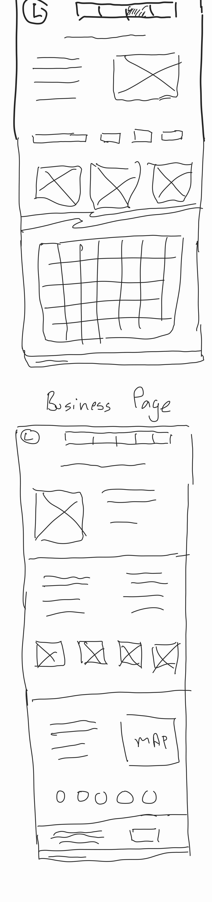
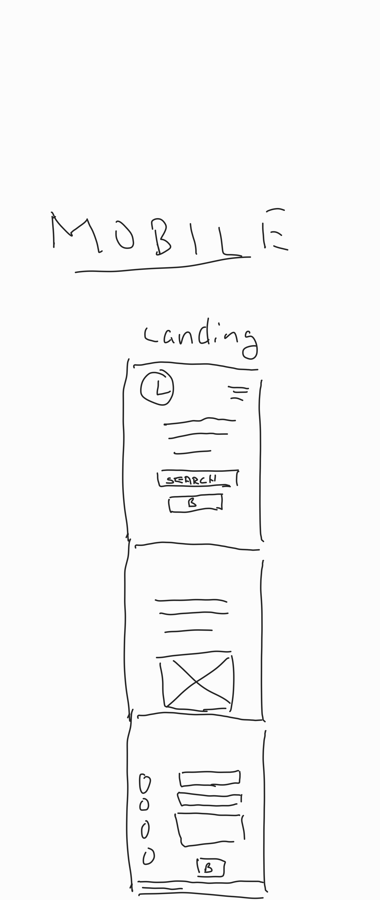

# MyHometown

## Purpose

    I want to help small and medium sized businesses by providing a platform for them to stand out.

    This project's goal is to develop a community-centric interface that provides:
        <ol>
            <li> A community page to allow sorting and filtering 
            <li> A community calendar of events that can be updated by members
            <li> A "Shingle"-page website for their business
            <li> A simple CMS to update and maintain their website
            <li> The ability for members to report non-local or non-SME businesses

