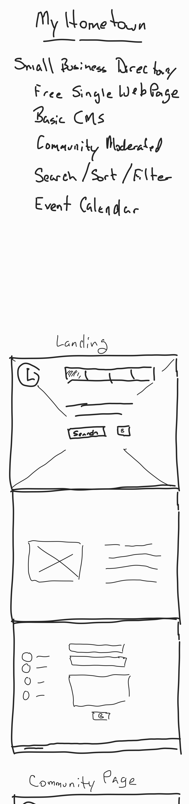

# MyHometown

## Purpose

    I want to help small and medium sized businesses by providing a platform for them to stand out.

    This project's goal is to develop a community-centric interface that provides:

            - A community page to allow sorting and filtering 
            - A community calendar of events that can be updated by members
            - A "Shingle"-page website for their business
            - A simple CMS to update and maintain their website
            - The ability for members to report non-local or non-SME businesses

